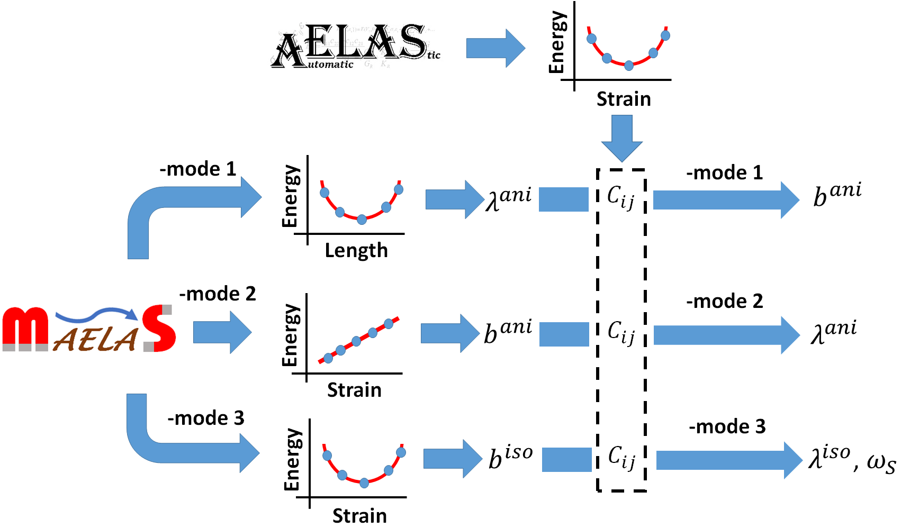
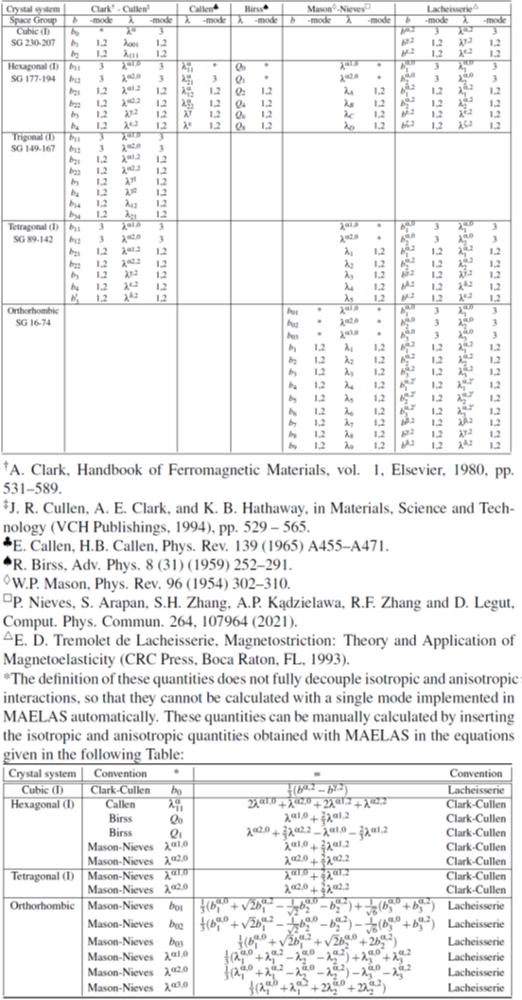
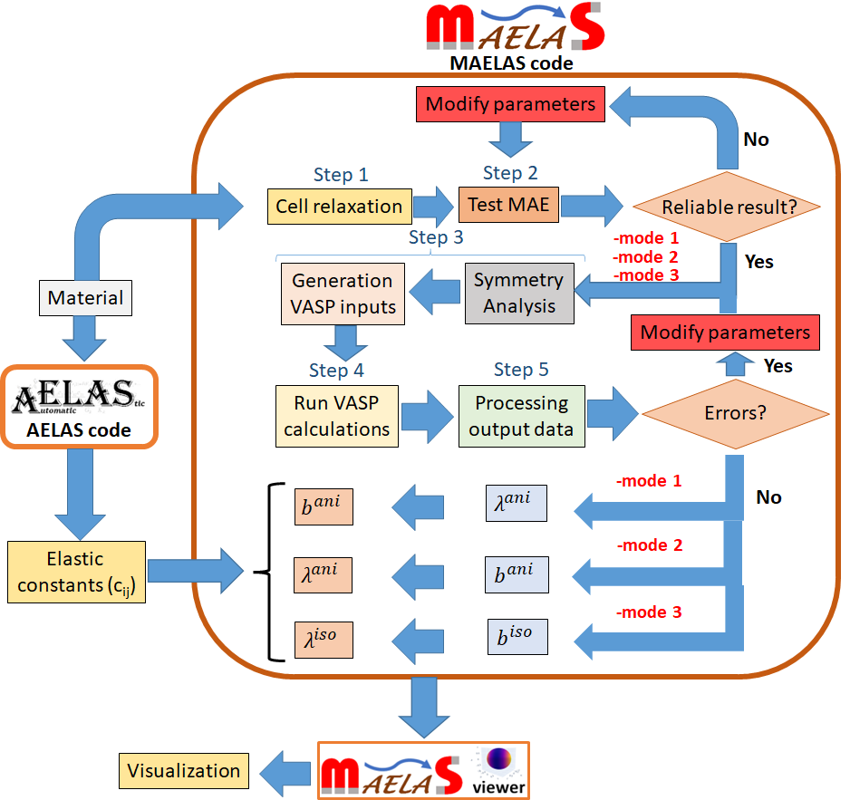
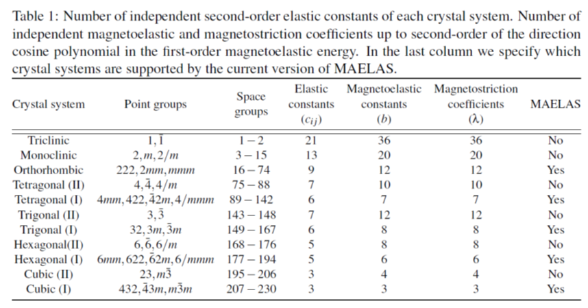

MAELAS code v3.0

Authors: P. Nieves, S. Arapan, S.H. Zhang, A.P. Kądzielawa, R.F. Zhang and D. Legut


------------------
UPDATE HISTORY FOR MAELAS
------------------

**Date: November 26, 2022** (new url for the online visualzation tool MAELASviewer)

Starting November 28th, 2022, due to a change in free Heroku services, the original Heroku url for the online visualization tool MAELASviewer:

[https://maelasviewer.herokuapp.com](https://maelasviewer.herokuapp.com)

will no longer be available. To fix this problem, we have migrated MAELASviewer to the following new url:

[http://www.md-esg.eu/maelasviewer/](http://www.md-esg.eu/maelasviewer/)

Note that this visualization tool can also be used offline by running it on your local computer, see more details here

[https://github.com/pnieves2019/MAELASviewer](https://github.com/pnieves2019/MAELASviewer)


**Date: October 4, 2022** (version 3.0.0)

The main new features of version 3.0 are:

- New methodology to calculate the isotropic magnetoelastic constants through
a cubic fitting of the energy versus strain. This new method can be executed by adding tag ```-mode 3``` in the command line. If the elastic tensor is provided, then it also calculates the isotropic magnetostrictive coefficients.

- The isotropic and anisotropic contributions to spontaneous volume magnetostriction are also calculated.

- The results are also printed using the universal notation proposed by E. du Tremolet de Lacheisserie [E. D. T. de Lacheisserie, Magnetostriction: Theory and Application of Magnetoelasticity (CRC Press, Boca Raton, FL, 1993)] which is valid for any crystal symmetry.

More details about these updates can be found in the Manual, as well as in the publication of version 3.0 

P. Nieves, S. Arapan, S.H. Zhang, A.P. Kądzielawa, R.F. Zhang and D. Legut,
“Automated calculations of exchange magnetostriction”, Computational Materials Science 224 (2023) 112158

[https://doi.org/10.1016/j.commatsci.2023.112158](https://doi.org/10.1016/j.commatsci.2023.112158)


**Date: September 15, 2021** (version 2.0.1)

We included the calculation of saturation magnetostriction for polycrystals with tetragonal, trigonal and orthorhombic symmetries. 


More details about these updates can be found in the Manual, as well as in the publication of version 2.0

P. Nieves, S. Arapan, S.H. Zhang, A.P. Kądzielawa, R.F. Zhang and D. Legut,
“MAELAS 2.0: A new version of a computer program  for the calculation of magneto-elastic properties”, Computer Physics Communications 271 (2022) 108197

[https://doi.org/10.1016/j.cpc.2021.108197](https://doi.org/10.1016/j.cpc.2021.108197)


**Date: June 7, 2021** (version 2.0.0)

The main new features of version 2.0 are:

- New methodology derived from the magnetoelastic energy for direct calculation of anisotropic magnetoelastic constants through
a linear fitting of the energy versus strain. This new method can be executed by adding tag ```-mode 2``` in the command line.
The method implemented in version 1.0 (based on the quadratic fitting of the energy versus length) is also available
in version 2.0, and it can be executed using tag ```-mode 1```.
The new method ```-mode 2``` is more accurate than ```-mode 1```, especially for non-cubic crystals.

- We fixed some issues related to the trigonal (I) symmetry in version 1.0:
 
	- The deformation gradient and measuring length direction for &lambda;<sub>12</sub> in trigonal (I) symmetry has been changed.

	- We also corrected the theoretical relations between &lambda;<sup>&gamma;,1</sup>, &lambda;<sup>&gamma;,2</sup> and &lambda;<sub>21</sub>  with the magnetoelastic and
elastic constants in trigonal (I) symmetry.


**Date: September 3, 2020** (version 1.0.0)

Implementation of the method based on the length optimization of the unit cell
proposed by Wu and Freeman [R. Wu, A. J. Freeman, Journal of Applied Physics 79, 6209–6212 (1996)] to calculate the anisotropic magnetostrictive coefficients. This method can be executed by adding tag ```-mode 1``` in the command line. If the elastic tensor is provided, then it also calculates the anisotropic magnetoelastic constants.

Published version 1.0:

P. Nieves, S. Arapan, S.H. Zhang, A.P. Kądzielawa, R.F. Zhang and D. Legut,
“MAELAS: MAgneto-ELAStic properties calculation via computational high-throughput approach”, Comput. Phys. Commun. 264, 107964 (2021).

[https://doi.org/10.1016/j.cpc.2021.107964](https://doi.org/10.1016/j.cpc.2021.107964)


-------------------------
WHAT IS MAELAS CODE?
-------------------------

MAELAS code is a software to calculate anisotropic magnetostrictive coefficients and magnetoelastic constants up to second order.
It generates required input files for VASP code to perform Density Functional Theory calculations, and it deduces:
    
```-mode 1``` = the value of ansitropic magnetostrictive coefficients (&lambda;<sup>ani</sup>) and anisotropic contribution to the spontaneous volume magnetostriction (&omega;<sub>s</sub><sup>ani</sup>) from the calculated energies given by VASP. If the elastic tensor is provided,
then it can also calculate the anisotropic magnetoelastic constants (b<sup>ani</sup>). It requires spin-polarized calculations with spin-orbit coupling (SOC).

```-mode 2``` = the value of anisotropic magnetolastic constants (b<sup>ani</sup>) from the calculated energies given by VASP. If the elastic tensor is provided,
then it can also calculate the anisotropic magnetostrictive coefficients (&lambda;<sup>ani</sup>) and anisotropic contribution to the spontaneous volume magnetostriction (&omega;<sub>s</sub><sup>ani</sup>). It requires spin-polarized calculations with SOC.

```-mode 3``` = the value of isotropic magnetolastic constants (b<sup>iso</sup>) from the calculated energies given by VASP. If the elastic tensor is provided,
then it can also calculate the isotropic magnetostrictive coefficients (&lambda;<sup>iso</sup>) and isotropic contribution to the spontaneous volume magnetostriction (&omega;<sub>s</sub><sup>iso</sup>). It requires spin-polarized calculations without SOC (including only isotropic magnetic interactions) or spin-polarized calculations with SOC (including anisotropic magnetic interactions). **Warning: the required reference state for this mode to obtain the spontaneous volume magnetostriction combines the equilibrium volume of the paramagnetic state and magnetic order of the ground state.**


MAELAS can also be used with other DFT codes instead of VASP, after file conversion to VASP format files.




------------------
INSTALLATION
------------------

The MAELAS code requires to have ```Python3(>=3.6)```. For example, in Ubuntu Linux machine you can check the installed version of ```python3``` by opening a terminal and typing
```bash
python3 --version
```
In case you need to install python3 in your machine, you can type
```bash
sudo apt-get update
sudo apt-get install python3
```

Note that in some HPC clusters you might need to load the Python module (ml Python).

To install MAELAS code, download and extract the .zip file, go to the folder that contains the file ```setup.py``` and type
```bash
chmod +x install-requirements.sh
python3 setup.py install --user --install_reqs
```

This procedure will also install all required dependecies automatically

```bash
pymatgen(>=2020.4.29)
scikit-learn(>=0.23.1)
pyfiglet(>=0.8.post0)
argparse(>=1.4.0)
numpy(>=1.18.4)
matplotlib(>=3.2.1)
scipy(>=1.4.1)
setuptools(>=40.8.0)
```

More available options for the installation can be found in the file ```INSTALL```.
By default, the executable file "maelas" is installed in the folder ```/home/$USER/.local/bin/``` where ```$USER``` is the name of your user name folder. This folder should be included to the ```PATH``` variable by adding the following line in the file ```/home/$USER/.bashrc```  
```bash
export PATH=/home/$USER/.local/bin/:$PATH
```
Then you should close the terminal and open the terminal again.

If you need to install pip3 on Ubuntu Linux, then type
```bash
sudo apt-get update
sudo apt-get install python3-pip
```

----------------------------------
CALCULATED QUANTITIES BY MAELAS
----------------------------------

MAELAS can automatically calculate the quantities shown in the following table:





----------------------------------
HOW TO USE MAELAS CODE
----------------------------------

Running MAELAS code consists in the following five steps.





--------------------------------------------------------
Step 1: Cell relaxation
--------------------------------------------------------

If your initial ```POSCAR``` is not relaxed and you want to perform a cell relaxation before calculating the magnetostriction coefficients, then you can use MAELAS code to generate ```INCAR``` and ```KPOINTS``` files to relax the structure with VASP. To do so, in the terminal you should copy your initial ```POSCAR``` in the same folder where you want to generate the input files for VASP, and after going to this folder then type
```bash
maelas -r -i POSCAR0 -k 40
```
where tag ```-r``` indicates that you want to generate VASP files for cell relaxation, ```-i POSCAR0``` is the input non-relaxed ```POSCAR``` file (you can name it whatever you want) and ```-k 40``` is the length parameter that determines a regular mesh of k-points. It will generate 4 files: ```POSCAR```, ```INCAR```, ```KPOINTS```, and ```vasp_jsub_rlx```. Here, one still needs to copy manually the ```POTCAR``` file in this folder in order to have all required files for VASP run. The generated file ```vasp_jsub_rlx``` is a script to submit jobs in HPC facilities, one can specify some settings in this script by adding more tags in the command line. Note that the user might need to modify ```vasp_jsub_rlx``` (it is in PBS Pro format) depending on the cluster or local computer batch scheduling. For instance,
```bash
maelas -r -i POSCAR0 -k 40 -t 48 -c 24 -q qprod -a OPEN-00-00 -f /scratch/example_rlx
```
where ```-t 48``` indicates that the number of maximum CPU hours for the VASP calculation is 48 hours, ```-c 24``` means that the number of cores for the VASP calculation is 24, ```-q qprod``` set to production queue the type of queue in HPC facilities, ```-a OPEN-00-00``` is the project identification number for running jobs in HPC facilities and ```-f /scratch/example_rlx``` is the folder where you want to run VASP calculations. All these data are included in the generated ```vasp_jsub_rlx``` file, so one can submit this VASP job immediately in HPC facilities by typing
```bash
qsub vasp_jsub_rlx
```
This procedure might be helpful for high-throughput routines. More options can be added in ```vasp_jsub_rlx``` file through the terminal command line, to see them just type
```bash
maelas -h
```
Note that generated ```INCAR``` and ```KPOINTS``` files contain standard setting for cell relaxation. The user might need to change these files in order to include more advanced settings.

In case your structure is already relaxed or you do not want to perform a cell relaxation, then you can skip this step and move to step 2.

--------------------------------------------------------
Step 2: Test MAE
--------------------------------------------------------

It is recommended to verify the Magnetocrystalline Anisotropy Energy (MAE) before the calculation of magnetostriction coefficients. In order to test MAE, copy the relaxed ```POSCAR```, ```POTCAR``` in the same folder where you want to generate the input files for VASP jobs. In the terminal, after going to this folder then type
```bash
maelas -m -i POSCAR_rlx -k 70 -s1 1 0 0 -s2 0 0 1
```
where ```-m``` indicates that you want to generate input VASP files for the calculation of MAE, ```-i POSCAR_rlx``` is the initial relaxed ```POSCAR``` file (you can name it whatever you want), ```-k 70``` is the length parameter that determines a regular mesh of k-points, ```-s1 1 0 0``` is the first spin direction to calculate MAE: s1x s1y s1z, while ```-s2 0 0 1``` is the second spin direction to calculate MAE: s2x s2y s2z. It will generate the following files:
* ```POSCAR_0_0``` (it is the same ```POSCAR``` as )
* ```INCAR_0_C``` (non-collinear calculation where C=1,2 is the spin orientation case)
* ```INCAR_std``` (collinear calculation to generate the ```WAVECAR``` and ```CHGCAR``` files to run non-collinear calculations)
* ```KPOINTS``` (file for the kpoint generation of VASP)
* ```vasp_mae```, ```vasp_mae_jsub```, and ```vasp_mae_0``` (interconnected bash scripts to run VASP calculations automatically)
* ```vasp_mae_cp_oszicar``` (bash script to get the calculated ```OSZICAR_0_0_C``` files after VASP calculation is finished)

The generated files vasp_mae, vasp_mae_jsub and vasp_mae_0 are interconnected scripts to submit jobs in HPC facilities. One needs only to execute the file vasp_mae in order to run all VASP jobs automatically. Note that the user might need to modify ```vasp_mae_jsub``` (it is in PBS Pro format) depending on the cluster or local computer batch scheduling. You can specify some job settings in these scripts by adding more tags in the command line. For instance,
```bash
maelas -m -i POSCAR_rlx -k 70 -s1 1 0 0 -s2 0 0 1 -t 48 -c 24 -q qprod -a OPEN-00-00 -f /scratch/example_mag
```

where ```-t 48``` indicates that the number of maximum CPU hours for the VASP calculation is 48 hours,```-c 24``` means that the number of cores for the VASP calculation is 24, ```-q qprod``` set to production queuethe type of queue in HPC facilities, ```-a OPEN-00-00``` is the project identification number for running jobs in HPC facilities and ```-f /scratch/example_mag``` is the folder where you want to run VASP calculations. This procedure might be helpful for high-throughput routines. More options can be added in these script files through the terminal command line, to see them just type
```bash
maelas -h
```

----------------------------------------------------------------------------------------------------------------------------------------------
Step 3: Generation of VASP input files (mode1, mode 2 and mode 3)
----------------------------------------------------------------------------------------------------------------------------------------------

Copy the relaxed ```POSCAR``` and ```POTCAR``` in the same folder where you want to generate the input files for VASP run.
In the terminal, after going to this folder then type
```bash
maelas -g -mode 1 -i POSCAR_rlx -k 70 -n 7 -s 0.01
```

or

```bash
maelas -g -mode 2 -i POSCAR_rlx -k 70 -n 7 -s 0.01 
```

or

```bash
maelas -g -mode 3 -i POSCAR_rlx -k 70 -n 7 -s 0.01 
```

where ```-g``` jointly with ```-mode 1``` indicates that you want to generate input VASP files for the calculation of anisotropic magnetostrictive
coefficients,  while ```-g``` jointly with ```-mode 2``` or ```-mode 3``` indicates that you want to generate input VASP files for the calculation of anisotropic or isotropic
magnetoelastic constants, respectively. ```-i POSCAR_rlx``` is the initial relaxed POSCAR file (you can name it whatever you want), ```-k 70``` is the length parameter that determines a regular mesh of k-points, ```-n 7``` means that it will generate 7 distorted states for each magnetostrictive coefficient and ```-s 0.01``` is the maximum value of the parameter s for the deformation gradient Fij(s) to generate the distorted POSCAR files. It will generate the following files:

* ```POSCAR_A_B``` (distorted cell where ```A```= anisotropic magnetostrictive coefficient (-mode 1) or magnetoelastic constant (-mode 2 or 3), ```B```=1,...,n distorted cell for each magnetostrictive coefficient or magnetoelastic constant)
* ```INCAR_A_C``` (non-collinear calculation where ```A```= anisotropic magnetostrictive coefficient (-mode 1) or anisotropic magnetoelastic constant (-mode 2), ```C```=1,2 is the spin orientation case). In -mode 3 these files are not generated because it only requires collinear calculations
* ```INCAR_std``` (collinear calculation to generate the WAVECAR and CHGCAR files to run non-collinear calculations in -mode 1 and -mode 2, or to compute the total energy in -mode 3)
* ```KPOINTS```
* ```vasp_maelas```, ```vasp_jsub```, and ```vasp_0``` (interconnected bash scripts to run VASP calculations automatically)
* ```vasp_cp_oszicar``` (bash script to get calculated ```OSZICAR_A_B_C``` files after VASP calculation finish)

The generated files ```vasp_maelas```, ```vasp_jsub``` and ```vasp_0``` are interconnected scripts to submit jobs in HPC facilities, one can specify some job settings in these scripts by adding more tags in the command line. Note that the user might need to modify ```vasp_jsub``` (it is in PBS Pro format) depending on the cluster or local computer batch scheduling. For instance,
```bash
maelas -g -mode 1 -i POSCAR_rlx -k 70 -n 7 -s 0.01 -t 48 -c 24 -q qprod -a OPEN-00-00 -f /scratch/example_mag
```
where ```-t 48``` indicates that the number of maximum CPU hours for the VASP calculation is 48 hours, ```-c 24``` means that the number of cores for the VASP calculation is 24, ```-q qprod``` set to production queue the type of queue in HPC facilities, ```-a OPEN-00-00``` is the project identification number for running jobs in HPC facilities and ```-f /scratch/example_mag``` is the folder where you want to run VASP calculations. This procedure might be helpful for high-throughput routines. More options can be added in these script files through the terminal command line, to see them just type
```bash
maelas -h
```
Note that generated ```INCAR_std```, ```INCAR_A_C```, and ```KPOINTS``` files contain standard setting for collinear and non-collinear calculations. The user can modify these files in order to add more advanced settings.

By default, -mode 3 assumes spin-polarized calculations without SOC (including only isotropic magnetic interactions), so that these generated files are suitable for this kind of calculation. In case you want also to include anisotropic magnetic interactions in the calculation of the isotropic magnetoelastic constants (-mode 3), then you need to add the flag -ani
```bash
maelas -g -mode 3 -ani -i POSCAR_rlx -k 70 -n 7 -s 0.01 
```
Now, it should generate the following files: POSCAR_A_B (A=1, B=1,..,7), INCAR_std, INCAR_A_C (C=1), KPOINTS, vasp_0, vasp_jsub, vasp_maelas, vasp_cp_oszicar and output.dat. These generated files are suitable for spin-polarized calculations with SOC. 


-----------------------------
Step 4: Run VASP calculations
-----------------------------

In -mode 1 and 2, for each generated ```POSCAR_A_B``` one should run first a collinear calculation using ```INCAR_std``` and use the generated ```WAVECAR``` and ```CHGCAR``` files to run non-collinear calculations for each ```INCAR_A_C``` (```C```=1,2) using the same ```POSCAR_A_B```. In -mode 3, for each generated POSCAR_A_B one should run only a collinear calculation. This procedure can be automatically done in HPC facilities just by running the generated bash script
```bash
./vasp_maelas
```
Note that the user might need to modify ```vasp_jsub``` depending on the cluster or local computer queuing system. This will launch independent jobs for each ```POSCAR_A_B```. Each job will run 3 VASP calculations: a collinear one to generate ```WAVECAR``` and ```CHGCAR``` files, and two non-collinear for ```INCAR_A_1``` and ```INCAR_A_2```. The jobs will be executed in subfolders ```P_A_B``` inside the folder indicated by tag ```-f``` in the step 3.

Once all jobs are finished, then one can easily get calculated non-collinear ```OSZICAR``` files (needed in step 5), by running the bash script
```bash
./vasp_cp_oszicar
```
it will copy these ```OSZICAR``` files and name them as ```OSZICAR_A_B_C``` (```C```=1,2) in the same folder where this script is executed.

------------------------------------------------------------------------------------------------------------------------------------------------------------
Step 5: Derivation of anisotropic magnetostrictive coefficients (-mode 1), anisotropic magnetoelastic constants (-mode 2) or isotropic magnetoelastic constants (-mode 3) from the energy written in the OSZICAR files
------------------------------------------------------------------------------------------------------------------------------------------------------------

Finally, to derive the anisotropic magnetostrictive coefficients (-mode 1) or magnetoelastic constants (-mode 2), one needs to have in the same folder the following files:

* ```POSCAR_rlx``` (the relaxed ```POSCAR``` file used as input in step 3)
* ```POSCAR_A_B``` (distorted ```POSCAR``` generated in step 3)
* ```OSZICAR_A_B_C``` (non-collinear ```OSZICAR``` files calculated in step 4 for each ```POSCAR_A_B``` and ```INCAR_A_C```)

Next, in the terminal go to this folder a type
```bash
maelas -d -mode 1 -i POSCAR_rlx -n 7
```
or

```bash
maelas -d -mode 2 -i POSCAR_rlx -n 7 -s 0.01
```
or

```bash
maelas -d -mode 3 -i POSCAR_rlx -n 7 -s 0.01
```

where ```-d``` jointly with ```-mode 1``` means that you want to derive the anisotropic magnetostrictive coefficients from the calculated
```OSZICAR``` files, while ```-d``` jointly with ```-mode 2``` or ```-mode 3``` will derive the anisotropic or isotropic magnetoelastic constants
from the calculated ```OSZICAR``` files, respectively. ```-i POSCAR_rlx``` is the relaxed ```POSCAR``` file used as input in step 3 (you can name it whatever you want)
and ```-n 7``` is the number of distorted states for each magnetostrictive coefficient (-mode 1) or magnetoelastic constant (-mode 2 or 3) used in step 3. For ```-mode 2```and ```-mode 3``` it is also necessary to write
the maximum applied strain in step 3 ```-s 0.01```.

It will derive and print the calculated anisotropic magnetostrictive coefficients (-mode 1), anisotropic magnetoelastic constants (-mode 2) or isotropic magnetoelastic constants (-mode 3) in the terminal. If you want to print it in a file (for example, ```results.out```), then you can type
```bash
maelas -d -mode 1 -i POSCAR_rlx -n 7 > results.out
```

In ```-mode 1```, the energy values extracted from ```OSZICAR_A_B_C``` files are shown in generated files ```ene_A_C.dat``` and
```fit_ene_A_C.png```. The energy difference between the two spin configurations for each magnetostrictive coefficient are shown in Fig. dE_A.png.

In ```-mode 2```, the energy values extracted from ```OSZICAR_A_B_C``` files are shown in generated files ```ene_A_C.dat```.
The energy difference between the two spin configurations and linear fitting for each magnetoelastic constant are shown in Fig. dE_A.png.

In ```-mode 3```, the energy values extracted from OSZICAR_A_B_C files are shown in generated files ene_A_C.dat and fit_ene_A_C.png. In case you want also to include anisotropic magnetic interactions in the calculation of the isotropic magnetoelastic constants (-mode 3), then you need to add the flag –ani
```bash
maelas -d -mode 3 -ani -i POSCAR_rlx -n 7 -s 0.01
```
Note that here you also need to copy the file called MAGANI generated in step 5 of -mode 2 which contains the data of the anisotropic magnetoelastic constants.


If the elastic tensor is provided as input, then MAELAS can also calculate the anisotropic magnetoelastic constants ```-mode 1```, anisotropic magnetostrictive coefficients ```-mode 2``` or isotropic magnetostrictive coefficients ```-mode 3```. To do so, one needs to add tags -b and -e with the name of the file
containing the elastic tensor with the same format and units (GPa), as written by AELAS code (file ```ELADAT```).
You can check this format in the Examples folder. Hence, you could type
```bash
maelas -d -mode 1 -i POSCAR_rlx -n 7 -b -e ELADAT
```
or

```bash
maelas -d -mode 2 -i POSCAR_rlx -n 7 -s 0.01 -b -e ELADAT
```
or

```bash
maelas -d -mode 3 -i POSCAR_rlx -n 7 -s 0.01 -b -e ELADAT
```
or

```bash
maelas -d -mode 3 -ani -i POSCAR_rlx -n 7 -s 0.01 -b -e ELADAT
```

where ```ELADAT``` is the name of the file (it could be whatever name you want) with the elastic tensor data.


----------------------------------------------------------------------
Summary: In a nutshell (-mode 1)
----------------------------------------------------------------------

Step 1: Cell relaxation
```bash
maelas -r -i POSCAR0 -k 40
qsub vasp_jsub_rlx
```

Step 2: Test MAE
```bash
maelas -m -i POSCAR_rlx -k 70 -s1 1 0 0 -s2 0 0 1
./vasp_mae
./vasp_mae_cp_oszicar
```

Step 3: Generate VASP inputs for calculation of anisotropic magnetostrictive coefficients
```bash
maelas -g -mode 1 -i POSCAR_rlx -k 70 -n 7 -s 0.01
```

Step 4: Run VASP calculations
```bash
./vasp_maelas
./vasp_cp_oszicar
```

Step 5a: Derivation of anisotropic magnetostrictive coefficients
```bash
maelas -d -mode 1 -i POSCAR_rlx -n 7
```

Step 5b: Derivation of anisotropic magnetostrictive coefficients and anisotropic magnetoelastic constants
```bash
maelas -d -mode 1 -i POSCAR_rlx -n 7 -b -e ELADAT  
```

----------------------------------------------------------------------
Summary: In a nutshell (-mode 2)
----------------------------------------------------------------------

Step 1: Cell relaxation
```bash
maelas -r -i POSCAR0 -k 40
qsub vasp_jsub_rlx
```

Step 2: Test MAE
```bash
maelas -m -i POSCAR_rlx -k 70 -s1 1 0 0 -s2 0 0 1
./vasp_mae
./vasp_mae_cp_oszicar
```

Step 3: Generate VASP inputs for calculation of anisotropic magnetoelastic constants
```bash
maelas -g -mode 2 -i POSCAR_rlx -k 70 -n 7 -s 0.01
```

Step 4: Run VASP calculations
```bash
./vasp_maelas
./vasp_cp_oszicar
```

Step 5a: Derivation of anisotropic magnetoelastic constants
```bash
maelas -d -mode 2 -i POSCAR_rlx -n 7 -s 0.01
```

Step 5b: Derivation of anisotropic magnetoelastic constants and anisotropic magnetostrictive coefficients
```bash
maelas -d -mode 2 -i POSCAR_rlx -n 7 -s 0.01 -b -e ELADAT  
```

----------------------------------------------------------------------
Summary: In a nutshell (-mode 3)
----------------------------------------------------------------------

Step 1: Cell relaxation
```bash
maelas -r -i POSCAR0 -k 40
qsub vasp_jsub_rlx
```

Step 2: Test MAE (it does not require in this mode since SOC is not used)
```bash
maelas -m -i POSCAR_rlx -k 70 -s1 1 0 0 -s2 0 0 1
./vasp_mae
./vasp_mae_cp_oszicar
```

Step 3: Generate VASP inputs for calculation of isotropic magnetoelastic constants
```bash
maelas -g -mode 3 -i POSCAR_rlx -k 70 -n 7 -s 0.01
```

Step 4: Run VASP calculations
```bash
./vasp_maelas
./vasp_cp_oszicar
```

Step 5a: Derivation of isotropic magnetoelastic constants
```bash
maelas -d -mode 3 -i POSCAR_rlx -n 7 -s 0.01
```

Step 5b: Derivation of isotropic magnetoelastic constants and isotropic magnetostrictive coefficients
```bash
maelas -d -mode 3 -i POSCAR_rlx -n 7 -s 0.01 -b -e ELADAT  
```

----------------------------------------------------------------------
Summary: In a nutshell (-mode 3 including anisotropic magnetic interactions)
----------------------------------------------------------------------

Step 1: Cell relaxation
```bash
maelas -r -i POSCAR0 -k 40
qsub vasp_jsub_rlx
```

Step 2: Test MAE (it does not require in this mode since SOC is not used)
```bash
maelas -m -i POSCAR_rlx -k 70 -s1 1 0 0 -s2 0 0 1
./vasp_mae
./vasp_mae_cp_oszicar
```

Step 3: Generate VASP inputs for calculation of isotropic magnetoelastic constants
```bash
maelas -g -mode 3 -ani -i POSCAR_rlx -k 70 -n 7 -s 0.01
```

Step 4: Run VASP calculations
```bash
./vasp_maelas
./vasp_cp_oszicar
```

Step 5a: Derivation of isotropic magnetoelastic constants (it requires file MAGANI generated in -mode 2)

```bash
maelas -d -mode 3 -ani -i POSCAR_rlx -n 7 -s 0.01
```

Step 5b: Derivation of isotropic magnetoelastic constants and isotropic magnetostrictive coefficients (it requires file MAGANI generated in -mode 2)

```bash
maelas -d -mode 3 -ani -i POSCAR_rlx -n 7 -s 0.01 -b -e ELADAT  
```


-------------------------------------------------------
Full list of arguments in MAELAS v3.0 
-------------------------------------------------------

User can see all possible optional arguments typing
```bash
maelas -h
```
Doing so, it will print the following text in the terminal:
```bash
usage: __main__.py [-h] [-mode MODE] [-i POS] [-n NDIST] [-s STRAIN] [-k KP] [-g] [-d] [-r] [-m]
                   [-s1 SPIN1 SPIN1 SPIN1] [-s2 SPIN2 SPIN2 SPIN2] [-b] [-e ELAS] [-sp SYMPRE]
                   [-sa SYMANG] [-sg SG0] [-nc] [-c CORE] [-t TIME] [-f VASP_FOLD] [-mp MPI]
                   [-a P_ID] [-l LOAD_MODULE] [-q QUEUE]

MAELAS code v3.0

optional arguments:
  -h, --help            show this help message and exit
  -mode MODE            -mode 1: Scheme for the direct calculation of the anisotropic
                        magnetostrictive coefficients. -mode 2: Scheme for the direct calculation
                        of the anisotropic magnetoelastic constants. Mode 2 is more accurate for
                        non-cubic symmetries. -mode 3: Scheme for the direct calculation of
                        isotropic magnetoelastic constants (default: 2)
  -i POS                Name of the initial non-distorted POSCAR file (default: POSCAR)
  -n NDIST              Number of distorted states for the direct calculation for each
                        magnetostriction coefficient (-mode 1) or magentoelastic contant (-mode 2
                        or -mode 3)(default: 7)
  -s STRAIN             Maximum value of the parameter s for the deformation gradient Fij(s) to
                        generate the distorted POSCAR files (default: 0.01)
  -k KP                 VASP automatic k-point mesh generation to create the KPOINTS file (default:
                        60)
  -g                    Generation of required VASP files for the direct calculation of
                        magnetostriction coefficients (-mode 1) or magnetoelastic constants (-mode
                        2 or -mode 3). Notation of the generated output files: POSCAR_A_B
                        (distorted cell where A=magnetostriction coefficient (-mode 1) or
                        magnetoelastic constant (-mode 2 or -mode 3), B=distorted cell), INCAR_A_C
                        (non-collinear calculation where C=spin orientation case), INCAR_std
                        (collinear calculation). How to run the VASP calculations: For each
                        generated POSCAR_A_B one should run first a collinear calculation using
                        INCAR_std and use the generated WAVECAR and CHGCAR files to run non-
                        collinear calculations for each INCAR_A_C using the same POSCAR_A_B. It
                        also generates bash scripts to run VASP calculations easily (vasp_maelas,
                        vasp_jsub, vasp_0) and to get calculated OSZICAR_A_B_C files
                        (vasp_cp_oszicar). In -mode 3 non-collinear calculations are not required.
  -d                    Derivation of magnetostriction coefficients (-mode 1) or magnetoelastic
                        contants (-mode 2 or -mode 3) from the energy written in the OSZICAR files.
                        WARNING!: OSZICAR files must be in the same folder where you run MAELAS
                        using the notation OSZICAR_A_B_C obtained for POSCAR_A_B and INCAR_A_C.
                        Distorted POSCAR files (POSCAR_A_B) must be in this folder too (jointly
                        with the initial non-distorted POSCAR which should be specified using tag
                        -i). Specify the number of distorted states to be considered in the
                        calculation of magnetostriction coefficients using tag -n, and the same
                        maximum applied strain (tag -s) used in the generation of VASP input files.
                        Energy values extracted from OSZICAR_A_B_C files are shown in files
                        ene_A_C.dat and fit_ene_A_C.png. The energy difference between the two spin
                        configurations for each magnetostriction mode are shown in Figs. dE_A.png
  -r                    Generation of required VASP files for the cell relaxation
  -m                    Generation of required VASP files to test MAE
  -s1 SPIN1 SPIN1 SPIN1
                        First spin direction to calculate MAE: s1x s1y s1z
  -s2 SPIN2 SPIN2 SPIN2
                        Second spin direction to calculate MAE: s2x s2y s2z
  -b                    Indirect calculation of the magnetoelastic constants from the calculated
                        magnetostriction coefficients and provided elastic tensor (-mode 1) or
                        indirect calculation of the magnetostrictive coefficients from the
                        calculated magnetoelastic constants and provided elastic tensor (-mode 2 or
                        -mode 3). For this option the tag -d must be included as well as tag -e
                        with the name of the elastic tensor file
  -e ELAS               File with the elastic tensor data in the same format and units (GPa) as it
                        is written by ELAS code (file ELADAT). You can check this format in the
                        Examples folder
  -sp SYMPRE            Tolerance for symmetry finding (default: 0.01)
  -sa SYMANG            Angle tolerance for symmetry finding (default: 5.0)
  -sg SG0               Space group number 1-230. If it is equal to 0, then it will be determined
                        by a symmetry analysis (default: 0)
  -nc                   If this flag is used, then it does not apply a conventional transformation
                        to the provided POSCAR (keep original size), useful for supercells and quasi-random structures
  -ani                  It includes anisotropic magnetic interactions in -mode 3. It requires the file MAGANI created in 				-mode 2 that contains the values of the calculated anisotropic magnetoelastic constants.
  -c CORE               Number of cores for the VASP calculation (default: 24)
  -t TIME               Number of maximum CPU hours for the VASP calculation (default: 48)
  -f VASP_FOLD          Folder where you will run VASP calculations (default: /scratch)
  -mp MPI               Command for mpi run of VASP (default: mpiexec.hydra)
  -a P_ID               Project id for running jobs in HPC facilities (default: OPEN-X-X)
  -l LOAD_MODULE        Module of VASP that should be loaded (default:
                        VASP/5.4.4-intel-2017c-mkl=cluster)
  -q QUEUE              Type of queue to be used for VASP calculations in HPC facilities (default:
                        qprod)
```           

---------------------------------------------------------------------------------
Using MAELAS with other codes instead of VASP
---------------------------------------------------------------------------------

MAELAS has been designed to read and write files for VASP code automatically. However, it is possible to use MAELAS with other DFT codes instead of VASP, after file conversion to VASP format files. Although, this process might require some extra work for the user. Namely, converting initial and distorted ```POSCAR``` files into the other DFT code format, reading the spin direction of each state from ```INCAR_A_C``` files (variable SAXIS) and write the calculated energies in a ```OSZICAR```-like file (called ```OSZICAR_A_B_C```) on the penultimate line and third column with same format as in VASP (this is the place where MAELAS reads the energy value of each ```OSZICAR_A_B_C``` file). See the Manual for more details.


In the folder Examples/LAMMPS we provide an example of an interface between MAELAS and program LAMMPS (classical spin-molecular dynamics).

--------------------------------------------------------------------------
Crystal systems supported by MAELAS v2.0
--------------------------------------------------------------------------

Current version supports the following crystal systems:

Cubic (I) (space groups 207-230)

Hexagonal (I) (space groups 177-194)

Trigonal (I) (space groups 149-167)

Tetragonal (I) (space groups 89-142)

Orthorhombic (space groups 16-74)


The crystal systems not supported by MAELAS might be included in the new versions of the code.





---------------------------------------------------------------------
Visualization tool
---------------------------------------------------------------------

We have also developed an online visualization tool called MAELASviewer. This interactive applet shows 
the magnetostriction for the supported crystal systems of MAELAS. Users can simulate the Joule and Wiedemann effects.


P. Nieves, S. Arapan, S.H. Zhang, A.P. Kądzielawa, R.F. Zhang and D. Legut,
“MAELASviewer: An Online Tool to Visualize Magnetostriction”, Sensors 2020, 20(22), 6436.

[https://doi.org/10.3390/s20226436](https://doi.org/10.3390/s20226436)
 
Starting November 28th, 2022, due to a change in free Heroku services, the original Heroku url for MAELASviewer:

[https://maelasviewer.herokuapp.com](https://maelasviewer.herokuapp.com)

will no longer be available. To fix this problem, we have migrated MAELASviewer to the following new url

[http://www.md-esg.eu/maelasviewer/](http://www.md-esg.eu/maelasviewer/)

Note that this visualization tool can also be used offline by running it on your local computer, see more details here

[https://github.com/pnieves2019/MAELASviewer](https://github.com/pnieves2019/MAELASviewer)


--------------------------------------------------------------------
Publications
--------------------------------------------------------------------

Version 1.0:

P. Nieves, S. Arapan, S.H. Zhang, A.P. Kądzielawa, R.F. Zhang and D. Legut,
“MAELAS: MAgneto-ELAStic properties calculation via computational high-throughput approach”, Comput. Phys. Commun. 264, 107964 (2021).

[https://doi.org/10.1016/j.cpc.2021.107964](https://doi.org/10.1016/j.cpc.2021.107964)


Version 2.0:

P. Nieves, S. Arapan, S.H. Zhang, A.P. Kądzielawa, R.F. Zhang and D. Legut,
“MAELAS 2.0: A new version of a computer program  for the calculation of magneto-elastic properties”, Computer Physics Communications 271 (2022) 108197

[https://doi.org/10.1016/j.cpc.2021.108197](https://doi.org/10.1016/j.cpc.2021.108197)


Version 3.0:

P. Nieves, S. Arapan, S.H. Zhang, A.P. Kądzielawa, R.F. Zhang and D. Legut,
“Automated calculations of exchange magnetostriction”, Computational Materials Science 224 (2023) 112158

[https://doi.org/10.1016/j.commatsci.2023.112158](https://doi.org/10.1016/j.commatsci.2023.112158)

